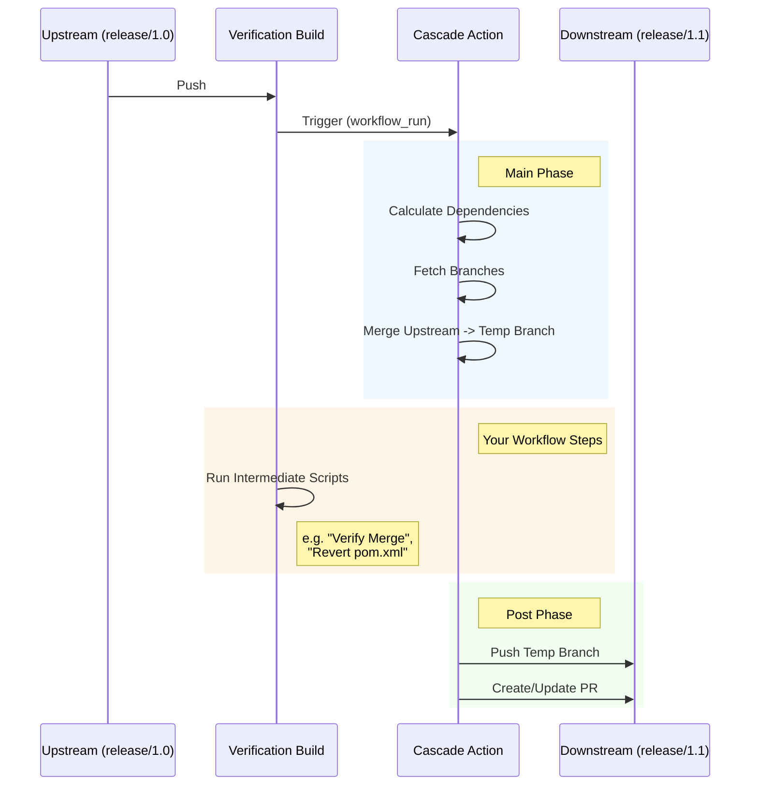

# Cascade Merge Action

**Automate the propagation of hotfixes and maintenance changes across your release branches.**

maintaining multiple versions of software often requires "cascading" changes: a bug fix applied to `release/1.0` usually needs to be merged into `release/1.1`, and subsequently into `release/2.0`. Doing this manually is tedious, error-prone, and often neglected.

**Cascade Merge** automates this workflow safely. It listens for successful builds on your upstream branches and automatically prepares, verifies, and proposes merges for your downstream dependencies.

### Key Features

* **🛡 Safe Propagation:** Only triggers merges if the original upstream build succeeds.
* **🧩 Flexible Dependency Graphs:** Define complex relationships (e.g., `v1.0` -> `v1.1`, `v1.1` -> `v1.2` & `experiment`).
* **✋ Intercept & Filter:** uniquely designed to allow **intermediate verification**. The action prepares the merge locally, pauses to let you run your own scripts (e.g., to revert version bumps or run tests), and only pushes the result if those scripts pass.
* **🤖 Automated PRs:** Automatically opens or updates Pull Requests for the downstream branches.

### How It Works

This action utilizes a **Main/Post** architecture to give you control over the merge content:



**Note:** All merges are performed in temporary branches (e.g., `merge/release/1.0/release/1.1`). This ensures your actual protected branches are never touched directly. You maintain full control via the generated Pull Requests.

# Usage example
```yaml
name: Cascade Merge

on:
  workflow_run:  # The only compatible trigger. A dedicated workflow is recommended.
    workflows: ["Verify branch"] # A workflow that verifies your maintenance branches
    types: [completed] # The only compatible status
    branches-ignore: ["merge/**"] # these are created by the action and have to be manually merged
    # branches: [release/1.0, release/1.1, release/1.9] # To reduce worfklow report noise, enumerate all origin branches from dependency_graph below. Optional, action will do nothing if branch is not represented in dependency_graph. Conflicts with branches-ignore. 

jobs:
  cascade:
    permissions:
      pull-requests: write # No PRs are created and warnings are produced without this permission.
      contents: write # Important. Allows branch creation.
    runs-on: ubuntu-latest
    steps:
      - uses: actions/checkout@v4
        with:
          token: ${{ secrets.PAT_TOKEN }} # To trigger downstream workflows after push

      # This creates local branches merge/release/1.0/release/1.1 etc.
      - name: Merge upstream to downstreams in temporary branches
        id: cascade
        uses: basilevs/cascade-merge@v1
        with:
          token: ${{ secrets.PAT_TOKEN }} # Used to create a PR, optional
          dependency_graph: |
            release/1.0: release/1.1 experiment4   # supports # comments, multiple spaces are ignored
            release/1.1: release/1.2               # one origin per line
            release/1.9: release/2.0.              # origin: dependent branches 
            release/2.0: feature/1 feature/2       # multiple dependent branches per line

      # Customize to prevent automatic merges of release-dependent changes
      - name: Reject unwanted changes
        if: steps.cascade.outputs.target_branches_list != ''
        run: |
          echo "${{ steps.cascade.outputs.target_branches_list }}" | while read -r downstream; do
            # Consider a change to pom.xml to be a version bump and reject the merge
            git diff --name-only --merge-base "origin/$downstream" "${{ github.event.workflow_run.head_sha }}" | grep pom.xml$ && exit 2 || true
          done

      # Step 3: The 'Post' phase of the cascade action runs automatically here.
      # It will push the branches and create PRs if all steps above succeed.
```
