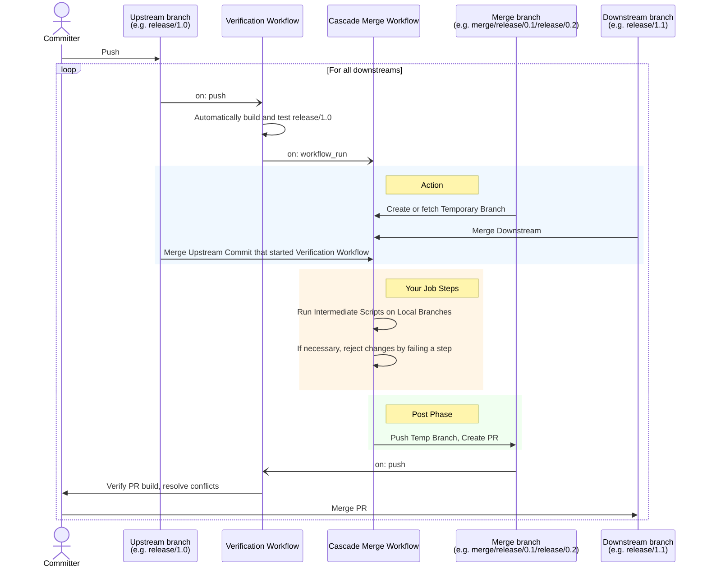

# Cascade Merge Action

[](https://github.com/basilevs/cascade-merge/actions/workflows/linter.yml)
[](https://github.com/basilevs/cascade-merge/actions/workflows/ci.yml)
[](https://github.com/basilevs/cascade-merge/actions/workflows/check-dist.yml)
[](https://github.com/basilevs/cascade-merge/actions/workflows/codeql-analysis.yml)


**Automate the propagation of hotfixes and maintenance changes across your
release branches.**

maintaining multiple versions of software often requires "cascading" changes: a
bugfix applied to `release/1.0` usually needs to be merged into `release/1.1`,
and subsequently into `release/2.0`. Doing this manually is tedious,
error-prone, and often neglected.

**Cascade Merge** automates this workflow safely. It listens for successful
builds on your upstream branches and automatically prepares, verifies, and
proposes merges for your downstream dependencies.

## Key Features

- **🛡 Safe Propagation:** Only triggers merges if the upstream verification
  build succeeds. All merges are performed in temporary branches. Actual
  protected branches are never touched directly. You maintain full control via
  the generated Pull Requests.
- **🧩 Flexible Dependency Graphs:** Define complex relationships (e.g., `v1.0`
  -> `v1.1`, `v1.1` -> `v1.2` & `experiment`).
- **✋ Intercept & Filter:** uniquely designed to allow **intermediate
  verification**. The action prepares the merge locally, pauses to let you run
  your own scripts (e.g., to revert version bumps or run tests), and only pushes
  the result if those scripts pass.
- **🤖 Automated PRs:** Automatically opens or updates Pull Requests for the
  downstream branches.

## How It Works

This action works in **Main/Post** phases to give you control over the
intermediate steps merge validation:



The main phase merges upstream and downstream in a temporary branch, but does not
push. If all custom steps done after the action, pass, the merge is consdered a
success and post-phase pushed the temporary branch at the end of the job.

## Usage example

```yaml
name: Cascade Merge

on:
  workflow_run: # The only compatible trigger. A dedicated workflow is recommended.
    workflows: ['Verify branch'] # A workflow that verifies your maintenance branches
    types: [completed] # The only compatible status
    # Do not react to branches authored by the action
    branches-ignore: ['merge/**']
    # Enumerate all origin branches from dependency_graph below.
    # Optional, action will skip such branches anyway
    # Needed only to reduce workflow run noise
    # Conflicts with branches-ignore.
    # branches: [release/1.0, release/1.1, release/1.9]

jobs:
  cascade:
    permissions:
      # No PRs are created and warnings are produced without this permission.
      pull-requests: write
      # Important. Allows branch creation.
      contents: write
    runs-on: ubuntu-latest
    steps:
      - uses: actions/checkout@v4
        with:
          # To trigger downstream workflows after push
          token: ${{ secrets.PAT_TOKEN }}

      # This creates local branches merge/release/1.0/release/1.1 etc.
      - name: Merge upstream to downstreams in temporary branches
        id: cascade
        uses: basilevs/cascade-merge@v1
        with:
          # Used to create a PR, optional, recommended
          token: ${{ secrets.PAT_TOKEN }}
          dependency_graph: |
            # supports # comments, multiple spaces are ignored
            release/1.0: release/1.1 experiment4
            # one origin per line
            release/1.1: release/1.2
            # origin: dependent branches 
            release/1.9: release/2.0
            release/2.0: main
            # multiple dependent branches per line
            main: feature/1 feature/2

      # Customize to prevent automatic merges of release-dependent changes
      - name: Reject unwanted changes
        if: steps.cascade.outputs.target_branches_list != ''
        run: |
          echo "${{ steps.cascade.outputs.target_branches_list }}" \
            | while read -r downstream; do
            # Consider a change to pom.xml to be a version bump 
            # and reject the merge
            git diff --name-only \
              --merge-base "origin/$downstream" \
              "${{ github.event.workflow_run.head_sha }}" \
              | grep pom.xml$ && exit 2 || true
          done
      # The 'Post' phase of the cascade action runs automatically here.
      # It will push the branches and create PRs if all steps above succeed.
```
